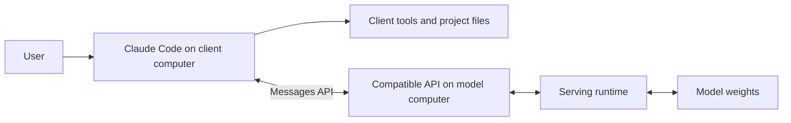

# How the connection works

This repository explains how to use an existing coding client with a separately
served model. It includes a small Python launcher for Claude Code and links to
Ollama's separate Desktop integration. It does not contain model weights, a
replacement Claude application, or an implementation of Claude Code.

## The components

| Component | Responsibility | Generic example |
| --- | --- | --- |
| Client / agent harness | Builds requests, manages the conversation, presents permissions and runs available tools | Claude Code in a terminal |
| Model | Predicts text and structured tool requests | A compatible Qwen model; Qwen Flash Next is an illustrative choice |
| Serving runtime | Loads weights, tokenizes requests, schedules inference and serves responses | Ollama or vLLM |
| API compatibility layer | Presents the request and response protocol the client expects | A runtime's Anthropic-compatible API |
| Transport | Carries HTTP traffic to the runtime | Loopback, HTTPS, or an SSH forward |
| Optional gateway | Adds translation, routing or other explicitly implemented behavior | A separately operated HTTP service |
| Project state | Holds actual files, instructions, test results and checkpoints | A local Git checkout |

These roles can share a process or computer, but they are distinct. Changing the
model does not replace the harness. Running Claude Code with Qwen does not make
it the separate Qwen Code CLI. Likewise, a terminal manager arranges sessions;
it does not make their models or memories interchangeable.

## Where work happens

With a remote model server, the project and ordinary client tools remain on the
computer running Code unless you explicitly configure a remote tool. Reading a
file happens there; the selected file content can then travel to the model as
part of the next request. The model server does not automatically receive a
filesystem mount merely because it receives prompts.

An MCP tool or external service may execute somewhere else. Inspect each tool's
configuration before assuming all tool activity is local.

## One complete tool round trip

Consider the request: “Read input.json, calculate the total, and save result.json.”

1. Code sends the prompt, relevant history and available tool schemas to the API.
2. The model returns a structured request for a client tool.
3. Code applies its permission rules and invokes that tool.
4. Code sends the tool result back in another model request.
5. The model may request more tools before returning its final answer.

The Messages protocol associates each `tool_result` with a `tool_use` identifier.
A tool request is not just a sentence saying “I will read the file.” That sentence
can be the entire response if the model ends its turn. The harness needs an actual
structured call to execute an action. See the [tool-use protocol](https://platform.claude.com/docs/en/agents-and-tools/tool-use/overview).

A useful diagnostic trace therefore connects four things: model request, returned
tool request, actual tool result, and final response. A successful chat greeting
does not exercise that chain.

## Is this just changing an endpoint?

For an already compatible server, selecting its URL, credentials and model alias
is the central configuration change. Compatibility is the condition that makes
the short command work.

| Boundary | What must agree |
| --- | --- |
| Address | API root and route construction; avoid accidentally adding `/v1` twice |
| Authentication | The server accepts the header scheme the client sends |
| Model selection | The requested alias resolves to the intended loaded model |
| Requests | Messages, system content and tool definitions are understood |
| Responses | Content blocks, IDs and stop reasons are valid |
| Streaming | Incremental text and tool arguments arrive in a valid event sequence |
| Continuation | Tool results can be included in the next request |
| Context | The complete request plus generation allowance fits the actual limit |
| Extra features | Each additional feature has backend and model support |

Changing an OpenAI-style `/v1/chat/completions` address to `/v1/messages` does not
translate the payload. A server or adapter must actually implement the required
protocol. Ollama documents a [subset of the Anthropic API](https://docs.ollama.com/api/anthropic-compatibility);
its documented limitations should be checked for the installed release.

## What the Python launcher does

Read [`examples/connect.py`](../examples/connect.py) for the executable source.
There are two paths: a catalog check and a client launch.

1. Parse the endpoint, exact model alias, configuration directory and optional SSH
   settings. An explicit URL cannot contain embedded credentials. Plain HTTP is
   restricted to loopback; remote URLs must use HTTPS.
2. If requested, open an owned SSH forward. The server is reached through a local
   loopback listener. The wrapper attempts to stop its own SSH process on exit.
3. Build the child environment. Remove inherited `ANTHROPIC_*` values and the
   explicitly listed alternate provider/OAuth selectors, then set the requested
   connection values.
4. For `--check`, request `/v1/models` and require an exact alias match. This path
   does not start Code or request generated text.
5. Otherwise, start the installed `claude` executable with `--model` and the
   remaining supplied arguments. Code, not this Python wrapper, performs the
   subsequent inference and tool loop.

| Setting | Launcher behavior |
| --- | --- |
| `ANTHROPIC_BASE_URL` | Selects the API root |
| `ANTHROPIC_AUTH_TOKEN` | Uses `LOCAL_MODEL_TOKEN`, or the dummy default for a backend that accepts it |
| `ANTHROPIC_API_KEY` | Set to an empty value to avoid inheriting a different API key |
| `ANTHROPIC_MODEL` and `--model` | Select the provided served alias |
| Default Haiku/Sonnet/Opus model variables | Point all three at that alias; this does not turn the model into those models |
| `CLAUDE_CONFIG_DIR` | Selects a separate configuration directory |

The catalog HTTP check refuses redirects and ignores environment HTTP proxies.
Those properties belong to that check; they are not a network policy applied to
the launched client. Other inherited variables, project settings, managed
settings, plugins and explicit arguments can still affect Code.

The launcher does not install Code, download weights, start a serving runtime,
rewrite model responses, implement compaction, enforce a generation budget,
configure Desktop, or reconnect an interrupted tunnel. Its existing tests cover
mocked connections and child-process behavior. See [the example instructions](../examples/README.md).

## Authentication and account separation

A dummy credential is useful only if the selected backend permits it. It does
not authenticate you to Anthropic and must not be substituted for a real token
on a protected service. The API URL and credential must describe the same route.

Keep a clearly named local launch command and isolated configuration. Use a
separate documented login/configuration for Claude models if you later want
those. Verify the effective route each time rather than relying on an icon,
window title or a generic billing label.

Anthropic states that non-Claude routing through gateways is unsupported by
Anthropic. Third-party integration instructions do not change that boundary.
Its gateway documentation also explains why changing only the URL is not the
same as replacing an active subscription credential. See [gateway support and authentication](https://code.claude.com/docs/en/llm-gateway).

## Desktop is a separate integration

This repository's Python launcher operates on the Code process it starts.
Launching a desktop application separately does not cause it to inherit that
child process's environment.

Ollama documents a macOS Desktop connection flow through its Apps interface.
Use [the Desktop guide](desktop.md) for model selection and restoration. This
repository does not provide a generic arbitrary-backend Desktop installer.
Running the Code example successfully is not evidence that Desktop, Cowork,
workspace startup or Desktop tool permissions work with the same backend.

## Local inference and network isolation

There are at least three different claims:

- **Same-computer inference:** generation runs on the client computer.
- **Self-hosted inference:** generation runs on another computer you operate.
- **Offline operation:** the complete tested workflow works without external
  network dependencies under an enforced network policy.

A loopback URL proves none of these by itself: a local gateway could forward to
a hosted service. Check the selected model, runtime and upstream route. Tools,
search, updates and telemetry also need separate consideration. Authentication
through an external identity provider is itself a dependency even when the
eventual inference traffic stays on a private network.

Continue with [deployment examples](deployment-examples.md), [context management](continuity.md),
or the [reproducibility procedure](reproducibility.md).
